# Creating a new xbench cloud region

## Create your VPC

Make a new VPC for you xbench project.  In this example, I am going to use the 10.0.0.0/16 network.  The region will need to be added to your cloud.yaml file.

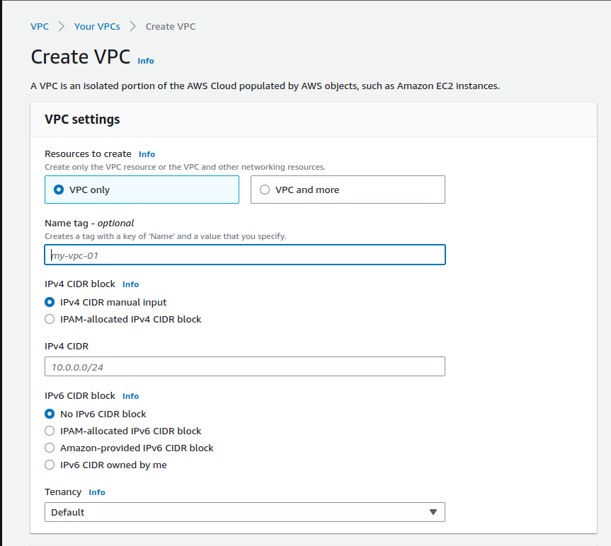

```yaml
providers:
  aws:
     xbench-us-west-1:  # this can be called anything.  Its just a label
      aws_region: us-west-1  # here is the region where your VPC is
```

## Create subnets in your VPC

Once you have created your VPC, you will need at least one subnet to deploy your infrastructure.  DIfferent AWS regions will offer you different AZ's.  Subnets are associated with specific availabilty zones, so by creating subnets in different AZ's, you can test highly available deployments or failover scenarios by deploying your infrastructure in these different AZ's.  I'm going to create 2 subnets.  One in the us-west-1b AZ and the other in the us-west-1c subnet.

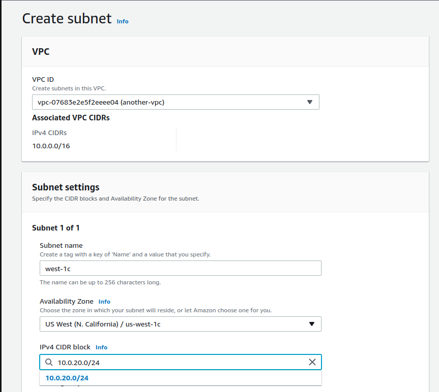

We will need each of the subnets to be reachable on public IPs, so we need to ensure that we configure each subnet to automatically provision a public IP for us.

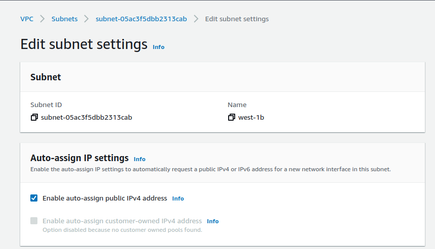

With each subnet created, you will need to add them to your cloud.yaml spec.

```yaml
providers:
  aws:
    xbench-us-west-1:
      aws_region: us-west-1
      zones:
        us-west-1b: subnet-1a2b3c4d5e  # this is a label, and the value is an example
        us-west-1c: subnet-2b3c4d5e6f
```

Each of these zones will be referenced in your impl.yaml to specify where you want to deploy

```yaml
# example impl.yaml using our new subnets
example_aws:
  cloud: aws
  region: xbench-us-west-1  # a reference to our VPC and region for earlier
  driver:
    zone: us-west-1b  # a reference to our subnet in the us-west-1b AZ
```

## placement groups

Like subnets in different AZ's a placement group will also allow you to deploy in very specific scenarios for benchmarking.  Here I use the "clustered" placement group to ensure that nodes deployed with my placement group are as physically close as possible.

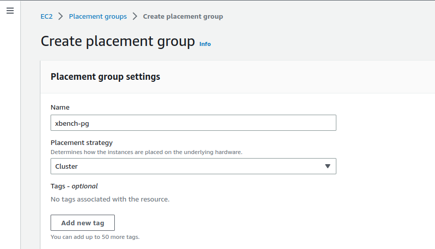

Once you are done, you will also want to add this to the cloud specification in cloud.yaml for the `placement_group` field

```yaml
providers:
  aws:
    xbench-us-west-1:
      aws_region: us-west-1
      zones:
        us-west-1b: subnet-1a2b3c4d5e  # this is a label, and the value is an example
        us-west-1c: subnet-2b3c4d5e6f
      placement_group: xbench-pg  # this is the name of the placement group
```

There are other types of PG's you can use documented here: <https://docs.aws.amazon.com/AWSEC2/latest/UserGuide/placement-groups.html>

## Security groups and access

The last bit of networking that we need to configure is inbound access rules.  For that we are going to create a security group.  Just like with our subnets, we will need to add this to our cloud specification in cloud.yaml

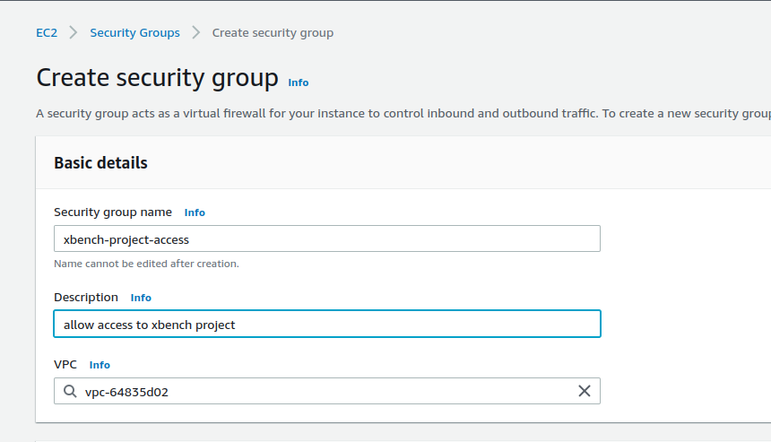

Each machine provisioned by xbench will be associated with this security group, so there are a few rules that we need to setup.  Each IP or user of hte project will need the following access

1. SSH (TCP 22)
2. MySQL (TCP 3306)
3. PostgreSQL (TCP 5432)
4. TCP 3000 (HTTP grafana)
5. TCP 9090 (HTTP prometheus)

Here is an example rule for a hypothetical user "john"

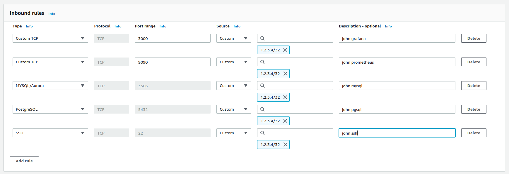

## Ssh key pairs

Xbench relies heavily on SSH, so we will need to have a key pair for the region.  Once you create the keypair, you will need to distribute the pem file to any users that want access.

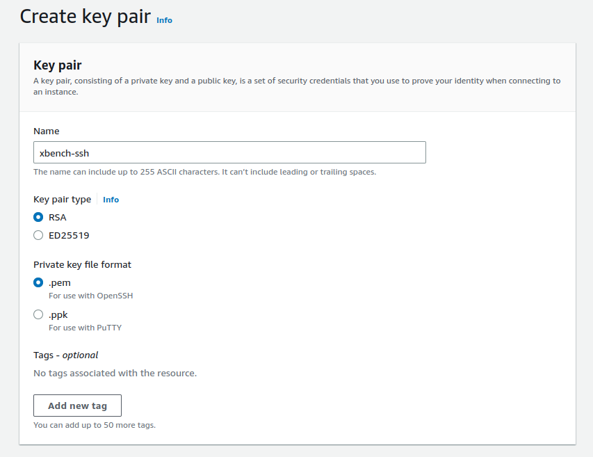

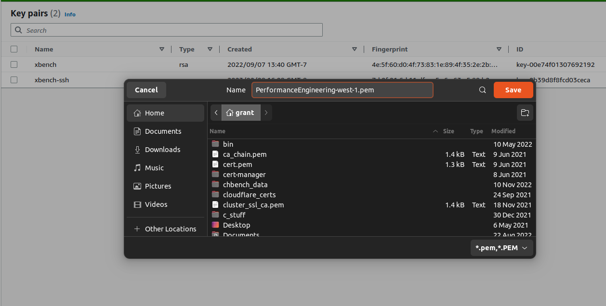

In your cloud.yaml file, you will need to add the name of the key pair to the config.  For the `key_file` field, this is the local file paht on your machine to the key pair pem file (typically `$HOME/.xbench/pem`).

```yaml
providers:
  aws:
    xbench-us-west-1:
      aws_region: us-west-1
      zones:
        us-west-1b: subnet-1a2b3c4d5e
        us-west-1c: subnet-2b3c4d5e6f
      key_name: xbench-ssh
      key_file: ENV['HOME']/.xbench/pem/PerformanceEngineering-west-1-ssh.pem
```

## Machine images for deployment

You will need to select at least one operating system to deploy with your infrastructure.  We use Rocky Linux, so I will get some of the official Rocky AMI's and add them to our project.

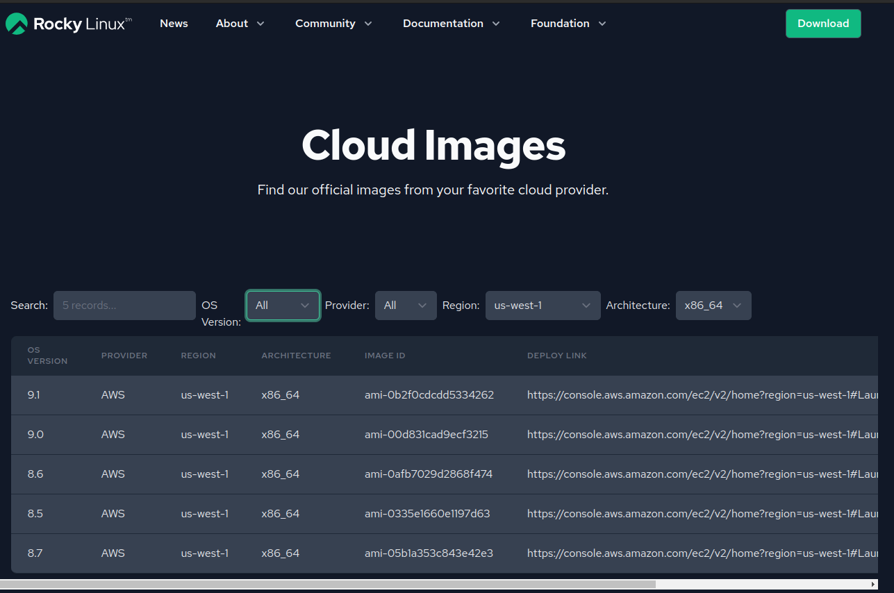

```yaml
providers:
  aws:
    xbench-us-west-1:
      aws_region: us-west-1
      zones:
        us-west-1b: subnet-1a2b3c4d5e
        us-west-1c: subnet-2b3c4d5e6f
      key_name: xbench-ssh
      key_file: ENV['HOME']/.xbench/pem/PerformanceEngineering-west-1-ssh.pem
      images:
        Rocky8:  # this is a label that you will use in your impl.yaml
          x86_64:
            image_id: ami-e5d4c3b2a1
            ssh_user: rocky
```

For the `ssh_user` field, you will need to know the OS default login user for your OS in your image.

Now you have a usable region in your xbench config and in your new cloud region.  The next steps will walk you through adding a metrics server to collect metric data from your benchmarks.  While you can use xbench without a metrics server, the metrics server will give you a powerful tool for collecting and exploring different performance metrics.

## Deploy your metrics server

The metrics server can be deployed by xbench as a special kind of backend.  Here is an example impl.yaml snippet

```yaml
metrics_test:
  cloud: aws
  region: us-east-2-PerformanceEngineering
  use_placement_group: False
  backend:
    klass: backend.MetricsServer
    klass_config_label: main
    count: 1
    instance_type: m5.large
    zone: us-east-2a
    os_type: Rocky8
    network: *public_cloud
    storage: *metrics_storage  # this is reference to a disk specification in another included yaml file
```

Now we can deploy with single xbench command

`xbench.sh --provision --cluster new-metrics-server --topo only_backend --impl metrics_test`

Once completed, you will have a metrics server almost ready for use.  Now let's add our metrics server to our cloud region so that all of our infrastructure deployed in the region will use the metrics server

```yaml
providers:
  aws:
    xbench-us-west-1:
      aws_region: us-west-1
      zones:
        us-west-1b: subnet-1a2b3c4d5e
        us-west-1c: subnet-2b3c4d5e6f
      key_name: xbench-ssh
      key_file: ENV['HOME']/.xbench/pem/PerformanceEngineering-west-1-ssh.pem
      images:
        Rocky8:  # this is a label that you will use in your impl.yaml
          x86_64:
            image_id: ami-e5d4c3b2a1
            ssh_user: rocky
      metric_server:
        hostname: 1.2.3.4  # the public IP of your deployed server
        username: rocky  # the ssh login
        key_file: ENV['HOME']/.xbench/pem/PerformanceEngineering-west-1-ssh.pem  # the ssh key pair you created earlier
        remote_target_path: /etc/prometheus/targets
```

The last step is creating and adding your service account key from grafana to the

## Creating your grafana service account key

First start by accessing the setting menu in grafana and going to "service accounts"

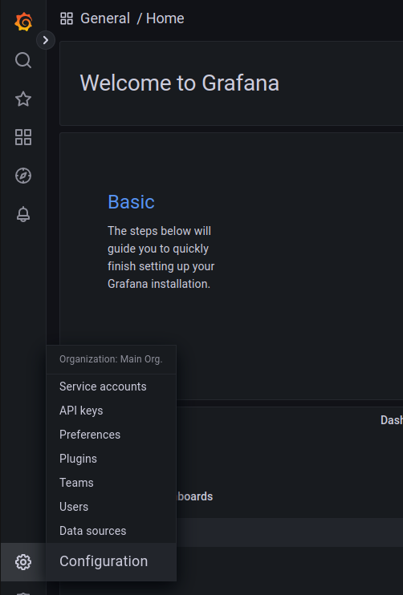

Next you will create a service account with "add service account".  In this example you can see an account I already created.

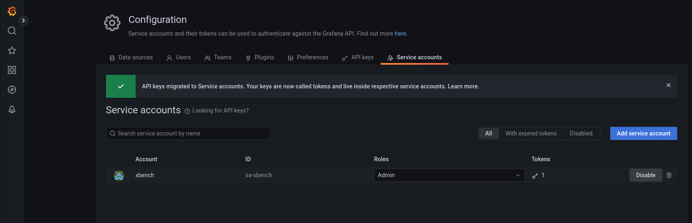

Make sure to choose the role "admin"

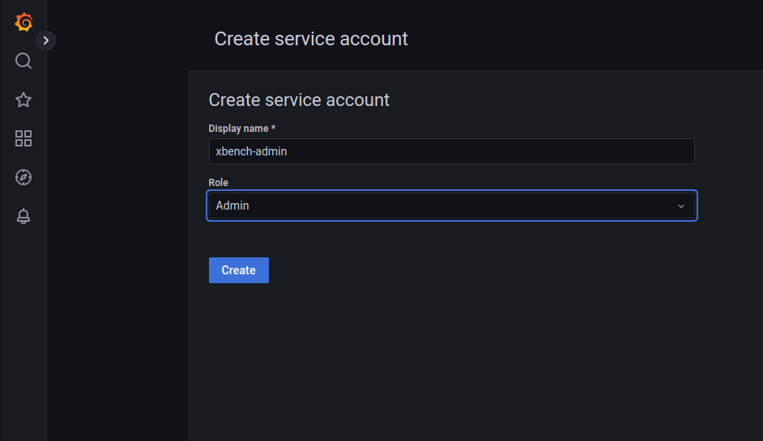

Then you need to gereate a token for the account by using "add service account  tokens"

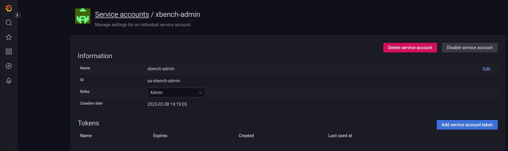

And lastly, generate the token and copy the value into your vault.yaml file.

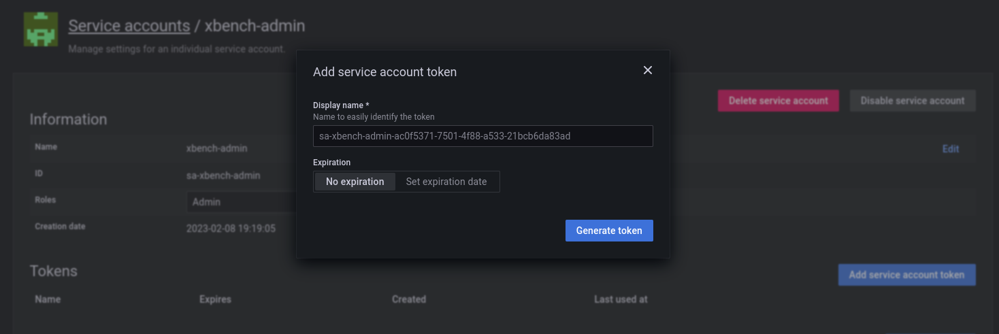

You will only see this value one time, so make sure to copy it before closing the dialog box.  Now we need to add it to out vault.yaml file and reference it in our cloud.yaml file

```yaml
# vault.yaml
aws_us_east_2_grafana_sa_token: qwertyuiop1234567890
```

Then we reference that key in our cloud.yaml for our metrics server

```yaml
# just showing the metric_server section from the earlier cloud.yaml examples
   metric_server:
     hostname: 1.2.3.4  # the public IP of your deployed server
     username: rocky  # the ssh login
     key_file: ENV['HOME']/.xbench/pem/PerformanceEngineering-west-1-ssh.pem  # the ssh key pair you created earlier
     remote_target_path: /etc/prometheus/targets
     sa_token: VAULT['aws_us_east_2_grafana_sa_token']
```
